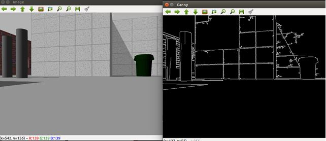
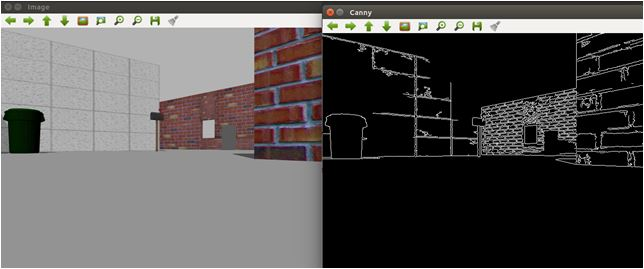
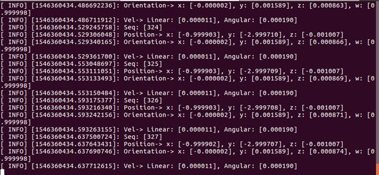
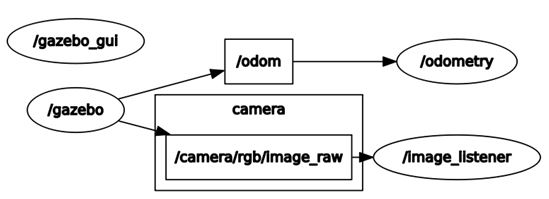

= RosOpencv-EdgeDetection 
 

&#160;
 
==== Edge detection in gazebo simulation using waffle pi robot

** Run

 rosrun opencv_ros imageProcess   
 

***
 rosrun opencv_ros odometry   
 

_Odometry data from the robot_

***

** rqt_graph

